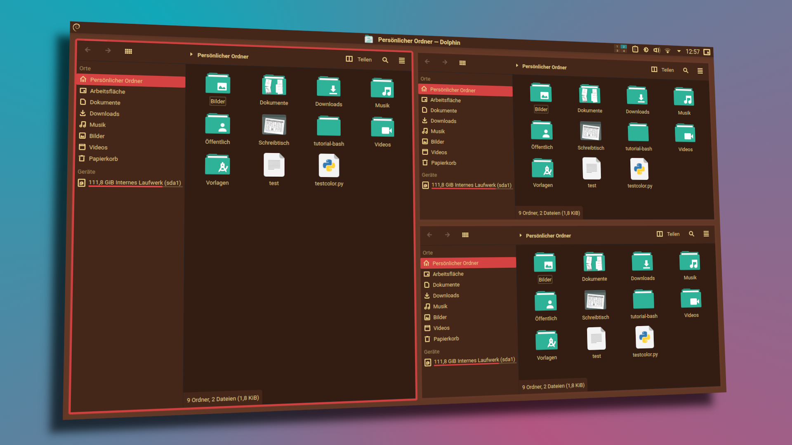

# Capycocoa-KDE
Capycocoa theme for various KDE programs.

The Kvantum and Plasma theme is based on [VimixBeryl](https://github.com/vinceliuice/Vimix-kde).
To install the whole desktop theme just install VimixBeryl and swap the Kvantum (Application-Style) and color-schemes (Colors) files found in 
.config/Kvantum/ 
and 
.local/share/color-schemes/ 
.
For the "Plasma-Style" section in "Global Design" simply select the style that says "following color-scheme".

In order to install the Konsole-theme copy the theme files in 
.local/share/konsole/ 
.

## Palette
#### Dark

#### Light

